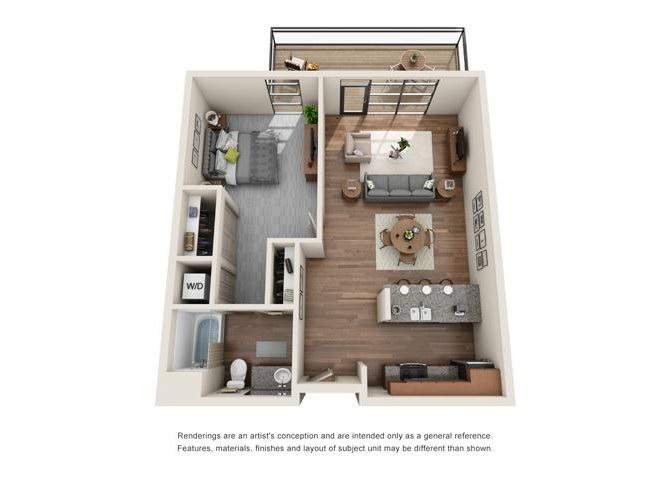
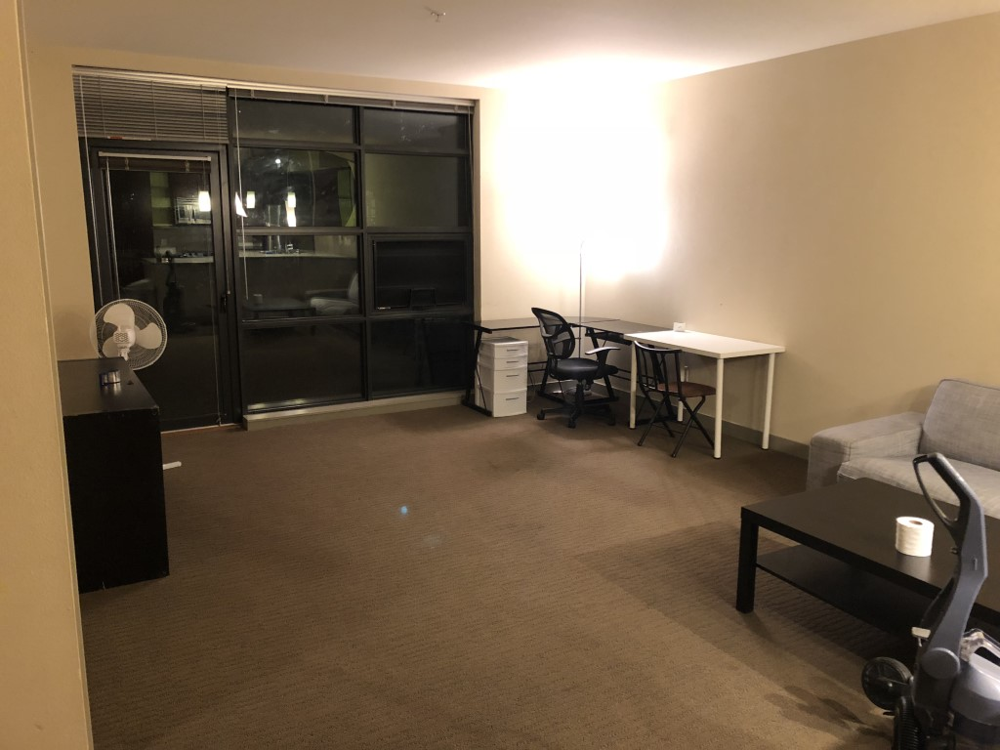
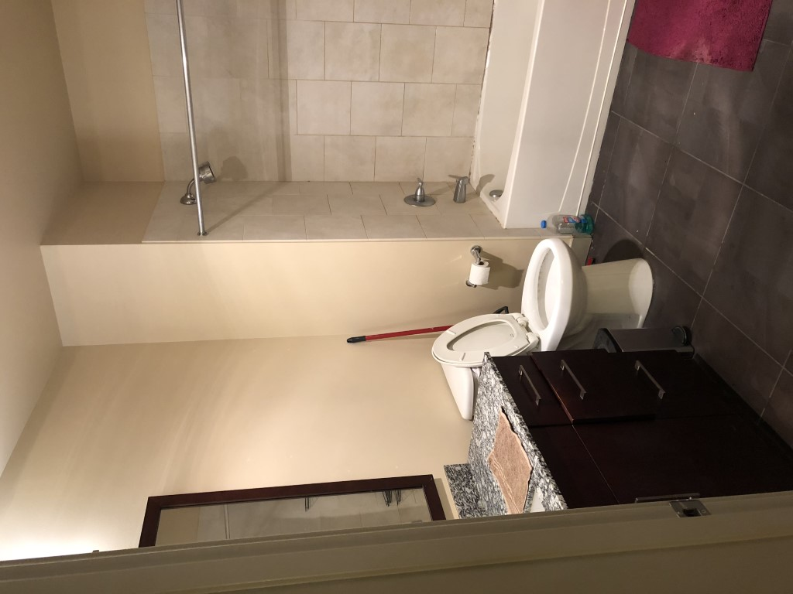
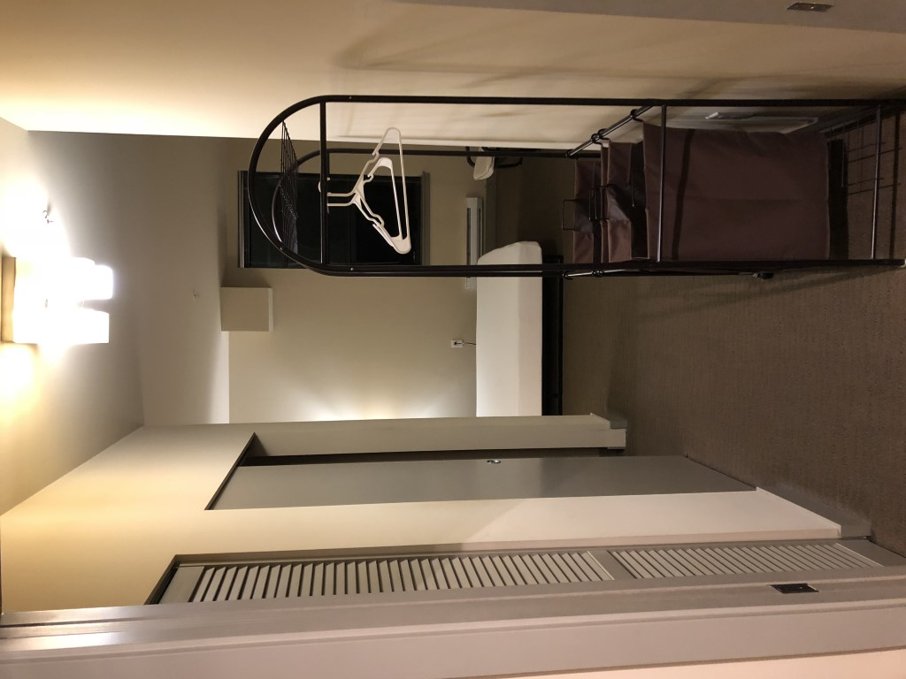
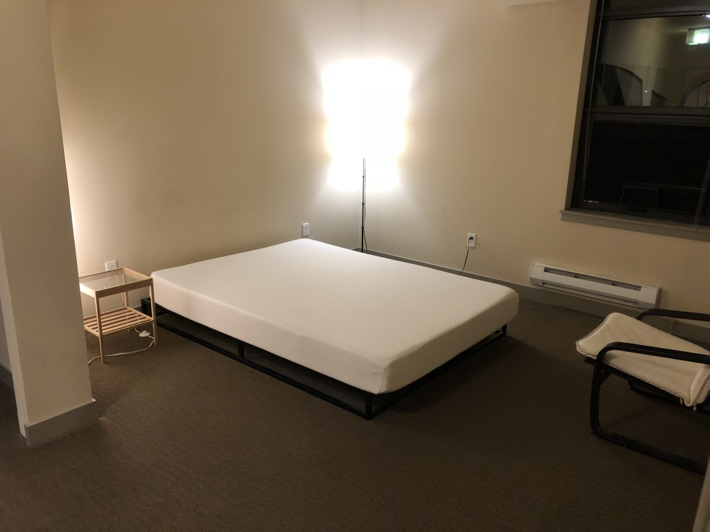
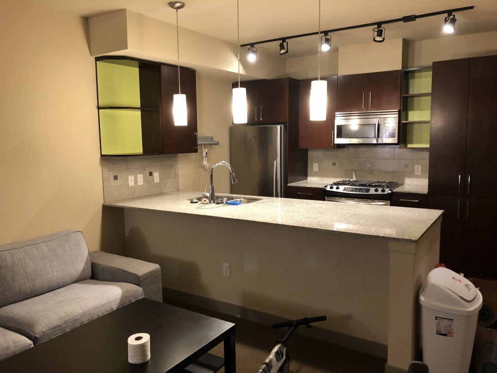
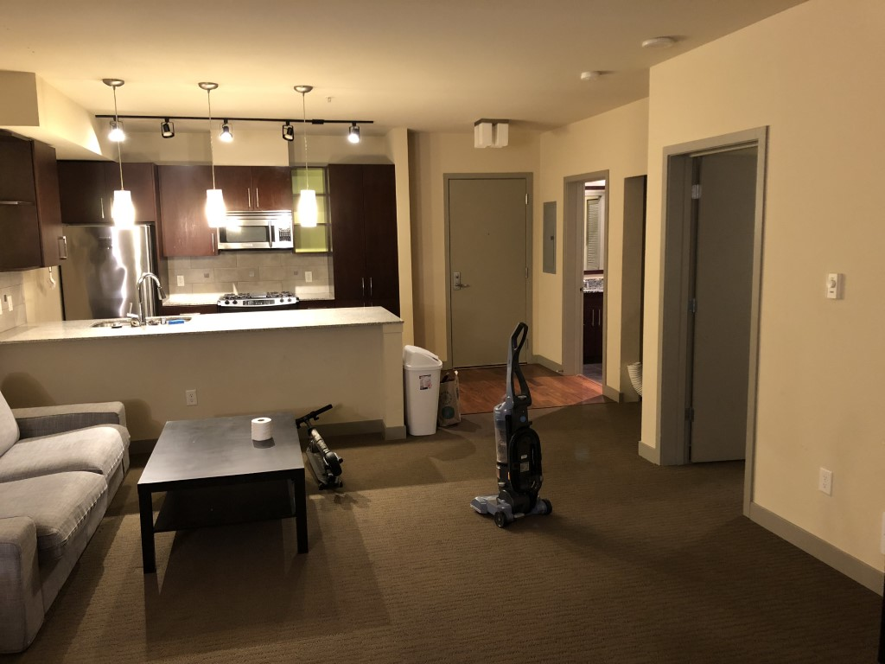
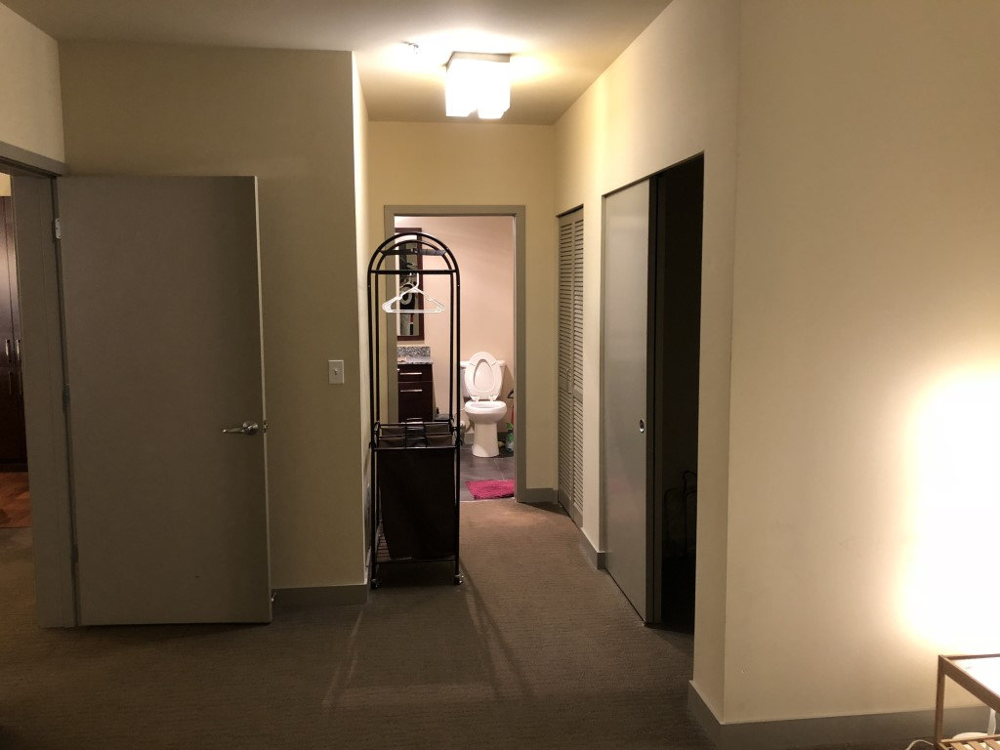

# Eastlake 1B1B 公寓转租，拎包入住 2100/月
* 地点： 1520 Eastlake Ave E, Seattle, WA, 98102
* 户型： 1B1B
* 公寓管理：[Equinox Apartment](https://www.equinoxseattle.com/)
* 月租金：2100刀（此户型市场价2613+）
* 入住日期：本人已搬走，随时可以入住
* 看房日期：随时看房
* 到期日期：2019年6月底
* 户主：亚麻员工
* 其他：记者勿扰

## 联系方式
* 电邮：huangwc94@gmail.com （最佳联系方式）
* 微信：huangwc94
* 电话：3128663816

## 介绍
因本人搬家，现有Eastlake高级公寓转租，地段黄金，楼下就有70路公交车，到SLU或者UW区域非常方便，即使走路去SLU也只有0.6mile。是新晋亚麻员工，UW学生不可多得的选择。  

公寓附近即有小卖部，各类餐厅，商业健身房（公寓自带免费健身房），咖啡馆等。不需要私家车都可轻松走遍西雅图。  

## 地理位置
公寓毗邻 Lake Union，楼下走路3分钟可以到达湖边，是慢跑，散步的不二选择。  
公寓后面不远有I5高速的出入口，交通方便，却又非常安静，晚上睡觉不会被高速上的车流打扰。  
70路公交车：10分钟直达SLU，15分钟直达UW主校区

## 公寓简介
Equinox公寓包含24小时免费健身房，3个公共客厅，提供电视，学习室，会议室，休闲区，如果有客人拜访或者组织party，可以免费租用公共区域。
公寓楼顶有超大露天阳台，可以烧烤，同时也能远眺西雅图的天际线。可以欣赏日落日出。
公寓还提供Parcel Locker服务，快递无忧，所有到达的快递都会被安在放置在locker room，需要短信验证码才可访问。  
公寓后街有免费街趴，也可选购150刀的地下车库，车库内车位充足，安全，电梯直达房间门口。  
邻居多为科技公司员工与UW学生，优质社区，安全有保证。

## 房间简介
此转租为公寓的1B1B户型(官网报价2600+刀/月)，3D图如下  
  
房间带阳台（与3D图不一样），面向联合湖。阳台总共有60+平，属于此房间的约有15平。
房间有洗衣机烘干机，小空调。网络需另装（xfinity即插即用）
房间在公寓后门隔壁，如果点外卖/Amazon Prime Now, 送到1520 Franklin Ave E, 只要走两步就可以拿到。同时搬入，搬出非常方便。外面的街可以街趴也可以开uhual搬家。
房间在mail box隔壁，取信件很方便
房间隔壁就是电梯。
已有家具，拎包入住。  

## 手续
前往公寓管理处，签订转租协议，需要你的各种证件以及

# 福利
1. 本人留下价值600刀的家具，只要300刀就全是你的了
2. 当时签房子的押金400刀，也是你的。
3. 公寓的电费系统好像不太好用，你懂的~~

## 图片

## 联系方式
* 电邮：huangwc94@gmail.com （最佳联系方式）
* 微信：huangwc94
* 电话：3128663816